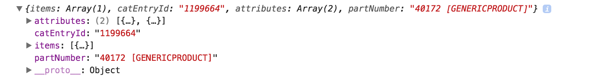
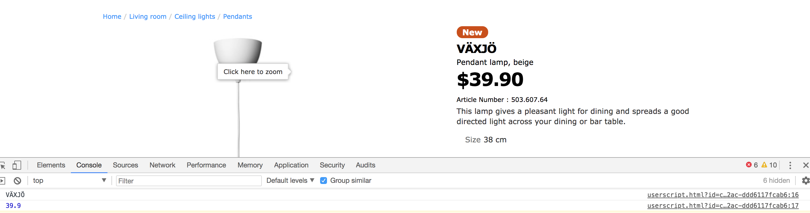
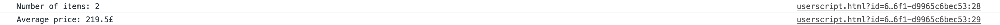
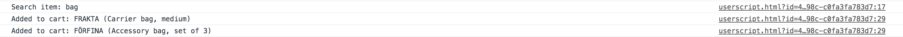

# First part. #

## 1. ##

I have to say that I did not have much of a front-end experience before starting this assignment.
The first solution to this task was pretty naive:

```html
<script>
console.log("homepage");
</script>
```

But soon I realised that the script should be loaded automatically and my manual HTML copy-edit-paste won't do.
I researched the available options for automatic script injection and Tampermonkey Chrome extension appeared to be
what I needed. There you can define your own scripts that can be executed automatically based on the URL path
specified.

```js
// ==UserScript==
// @name         HomepageScript
// @namespace    http://tampermonkey.net/
// @version      0.1
// @description  Prints "homepage" when on homepage
// @author       You
// @match        http://www.ikea.com
// @grant        none
// ==/UserScript==

(function() {
    console.log("homepage");
})();
```
Worked alright.


## 2. ##

Printing name and the price was trickier. Parsing HTML is a straightforward solution but not a smart one. So I looked through
the sources to see which file was responsible for setting product fields. File called "prodInfo_v6_4_5.js" had what I needed.
It stored so called "chosenProduct" variable globally and I checked if I could get something to be printed with something like:
 ```js
    console.log(chosenProduct);
 ```
 And the result was quite satisfying:
 
 
 Okay, now I could extract all the information I needed from there I make it be logged on every /product/* page:
 ```js
 // ==UserScript==
 // @name         New Userscript
 // @namespace    http://tampermonkey.net/
 // @version      0.1
 // @description  Prints product name and price to the console
 // @author       You
 // @match        http://www.ikea.com/sg/en/catalog/products/*
 // @grant        none
 // ==/UserScript==
 
 window.addEventListener("load", function(event) {
     console.log(chosenProduct["items"][0].name);
     console.log(chosenProduct["items"][0].prices["normal"].priceNormal["rawPrice"]);
 });
 ```
  
  
 
  
## 3. ##

After playing around with the shopping cart page I got my IP blocked. How did I know? Well, I got "Access denied" message
but it was loading fine via VPN. I continued my research through VPN and it got blocked also. 
So I am afraid I can not finish this particular part. But if I had another WiFi source I would just parsed out
all items from HTML. 
Update(9.03.2017):
Okay, I guess they unblocked me. So simple HTML parsing with jquery would look something like this:

```js
var counter = 0;
var sum = 0;
var units = '';
$( 'div[class="IKEA-PageModule-ShoppingBag-_Item"' ).each(function( index, value ) {
    counter += 1;
    var priceRawString = $(value).find('p[itemprop="price"]')[0].innerText;
    // Replacing units like $ from the first position of the string
    stripedPrice = priceRawString.substr(1, priceRawString.length);
    if (units == ''){
        units = priceRawString.substr(0, 1);
    }
    sum += parseFloat(stripedPrice);
});
console.log("Number of items: " + counter);
console.log("Average price: " + sum / counter + units);
```

 

## 4. ##

Search item can be retrieved in two ways: from the html header and from the URL.
I decided to do it via URL because it was cleaner:
   ```js
   // @match        http://www.ikea.com/gb/en/search/*
    window.addEventListener("load", function(event) {
        var itemName = location.search.split('k=')[1];
        console.log(decodeURIComponent(itemName));
    }); 
   ```
Tracking button clicks was little trickier than I thought. Firstly, I found all "Add to cart" buttons on the page and added
click listeners to them. Listener callback would then find the parent view of the button and all the needed data from it.
   ```js
   function nameFromTheItemContainter(obj) {
       var productName = $(obj).find('h2[class="pie-productname"]')[0].innerText;
       var description = $(obj).find('p[class="pie-description"]')[0].innerText;
       return productName + " (" + description + ")";
   }
   
   var itemsDisplayed = $('div[class="Product_Compact__content"');
   itemsDisplayed.each(function( index, value ) {
       var button = $(value).find('button[class="btn btn-blue btn-icon IKEA-Component-Form-Submit-Submit-button"]')[0];
       $(button).click(function (event) {
           console.log("Added to cart: " + nameFromTheItemContainter(event.originalEvent.srcElement.offsetParent));
       });
   });
   ```
   
   
   
## 5 ##


   Last task was pretty simple once I got little familiar with jQuery library.
   ```js
       var buttons = $('.btn-blue');
       $(buttons).each(function( index, value ) {
           value.style.setProperty("background-color", "#fc9f22", "important");
           value.style.setProperty("border-color", "#fc9f22", "important");
       });
   ```
   
   
# Second part (B)#

Since I was not given a sample database entries, I can suppose that that database would look 
something like that:

    +-------------+-------------+-----------+------------+------------+
    | Purchase_ID | Customer_ID | Location  | Product_id |    Date    |
    +-------------+-------------+-----------+------------+------------+
    |    12345678 |   201456731 | London    | aaaaaaa    | 1520614528 |
    |    41432423 |   201451231 | Prague    | bbbbbbb    | 1520613328 |
    |    14453535 |   201412331 | Edinburgh | ccccccc    | 1520612528 |
    +-------------+-------------+-----------+------------+------------+ 

Possible solutions:
1. Retrieve user names and locations randomly. There is no guarantee that the randomly retrieved dataset 
   won't have the data of the actual user but this could be fixed by introduction of additional check in WHERE-clause
   of the SQL query. But since doing random SELECTs over very large data sets can be quite costly in 
   perfomance this is not an ideal approach.  
2. Retrieve user names from table with sample names and choose location randomly.
The one drawback of this solution is that the table with sample names should be large enough
   in order to provide decent level of realism. We would not want the buyer to see same people names as
   he goes from one page to the other. There is the same perfomance issue as with #1 since we are selecting
   randomly on a very large dataset. 
3. The best solution in terms of perfomance and realism would be creating special tables with mock data
both for names and locations. It would require thorough semantic analysis of existing data in order to accurately map the 
possibility of getting a certain user name to the specific location. That way we completely solve three problems we had that we had:
    1. Anonymity of the actual buyer
    2. High level of realism given that our dataset is broad enough.
    3. Perfomance would be way higher since our table will certainly be smaller than the table with purchase information.
    
Given that proposed dataset would look something like:

    +--------+-----------+
    |  Name  | Location  |
    +--------+-----------+
    | Sally  | New-York  |
    | Alexei | Prague    |
    | Brian  | Edinburgh |
    +--------+-----------+

The SELECT query would be pretty simple as following:
```sql
SELECT Name, Location
FROM MockTable
WHERE Location LIKE '%@Location%'
ORDER BY RAND()
LIMIT 1
```